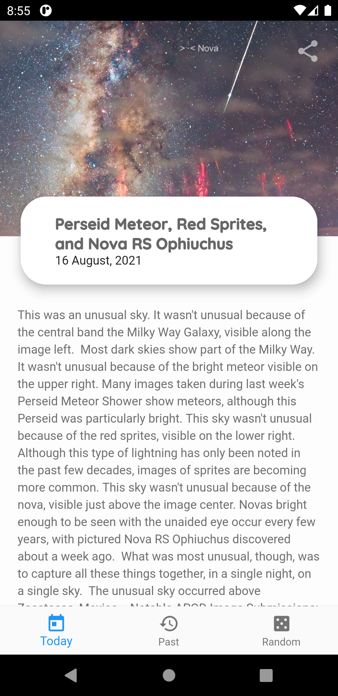

# APOD
APOD stands for "Astronomy Picture Of the Day".

# App download

## Screenshot
 

## Features
- Today's [APOD](https://apod.nasa.gov/apod/)
- Last 90 days worth of APODs
- Get a random APOD
- Share
- Support for videos and other web content
