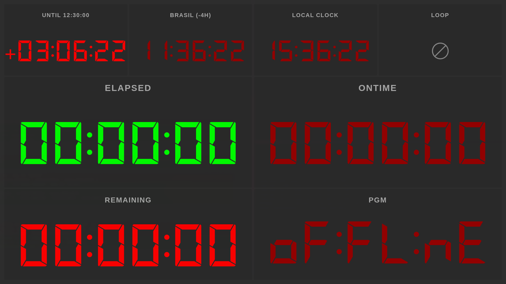

CGTimer 3.0 is out. It's a major release that rebuilds the app around a flexible layout system and adds first-class support for the production tools I keep reaching for: OSC control surfaces and Blackmagic HyperDeck recorders.

Download: [github.com/jcalado/cgtimer/releases/tag/v3.0.0](https://github.com/jcalado/cgtimer/releases/tag/v3.0.0)

## A layout system that gets out of the way

The biggest change is that the dashboard is no longer a fixed arrangement. You can split panels horizontally or vertically, drag widgets between slots, and pull new widgets in from a palette. Resize anything by dragging the dividers, and reconfigure widgets (label, colors, options) inline. Press **F** at any time to go fullscreen.

If you used the old version, the default layout still stacks a remaining timer over an elapsed timer, so first-run still feels familiar.

## New widgets

- **Time-of-day countdown**, replacing the older production clock. Pick a wall-clock time and the widget counts down to it.
- **Timezone clocks** for any city or zone, with themed previews so you can see what they'll look like before adding them to a layout.
- **HyperDeck status**, showing live timecode and recording state from a connected Blackmagic HyperDeck.
- A unified renderer for the remaining, elapsed, and loop timers so they all share the same typography.
- The loop icon now spins while a loop is active, so it's easy to tell at a glance.

All clocks are now driven from a single wall-clock-aligned tick, so widgets on the same screen no longer drift apart by a fraction of a second.

## OSC and HyperDeck

CGTimer now ships an OSC server, so an external console can drive timer commands (start, stop, reset, and so on) and switch between layouts remotely. That last part is the one I wanted most: building a production layout once and switching to it from a button on a Companion or QLab surface.

HyperDeck support is end-to-end: configure recorders from the new Recorders tab in preferences, monitor their status, and drop a HyperDeck widget into your layout to see the deck's timecode next to your timers.

## Preferences, rewritten

The Forge-generated preferences window is gone. In its place is a custom Fluent UI window with five tabs: Application, Colors, Timezones, Recorders, and Server. Open it with **Cmd/Ctrl + ,**. Toggles in the Production tab are now inline, the Colors tab has been reformatted, and the Timezones tab has a themed time preview so you can pick zones without guessing.

## Multi-display

Display matching is now hardened against monitor IDs changing across reboots, so windows return to the right screen instead of jumping around. Fullscreen and window positioning behave correctly when you plug or unplug displays mid-session.

## Builds

3.0 ships builds for everything I can produce on CI:

- macOS arm64 (`.dmg`, `.zip`)
- Windows (`Setup.exe` installer and a new portable `.exe`)
- Linux (`.AppImage`, `.deb`)

Auto-update metadata is published alongside the artifacts on all three platforms.

## Under the hood

If you fork the project, the toolchain is now Vite plus electron-builder, replacing the previous Webpack and Electron Forge setup. Builds are noticeably faster and the config surface is much smaller. Electron, React, and Fluent UI are all on their latest majors (41, 19, and v9 respectively).

Issues, ideas, and PRs welcome at [github.com/jcalado/cgtimer](https://github.com/jcalado/cgtimer).
