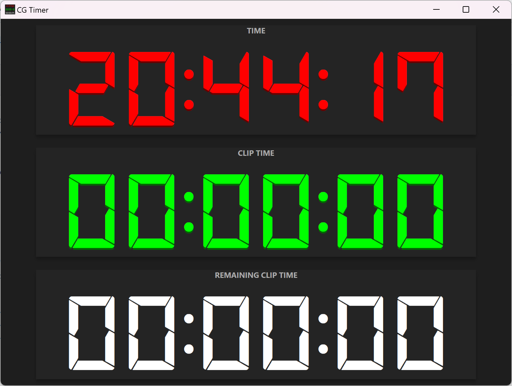

# CGTimer

CGTimer is an Electron app to display current video time from a CasparCG server instance.

## Features

- Displays active clip current time
- Displays remaining clip time
- Starts flashing red at less than 5 seconds to clip end
- Warns about video being looped, via a red "L" on the clip time panel
- When CasparCG is issued a STOP command to the ffmpeg producer, everything is reset

## Preview

## Source Code

View the project on [GitHub](https://github.com/jcalado/cgtimer)
