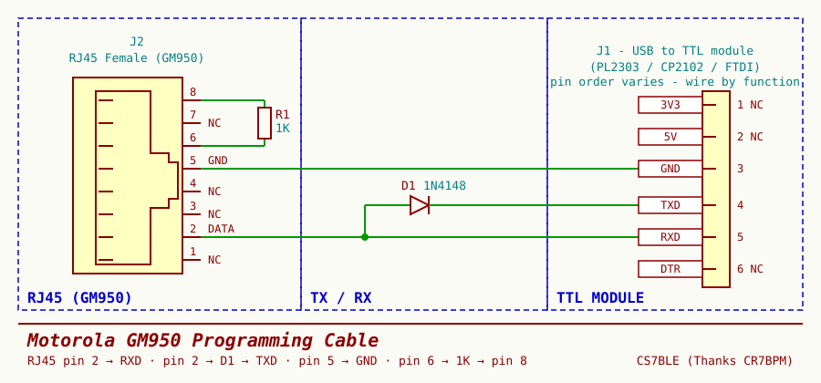
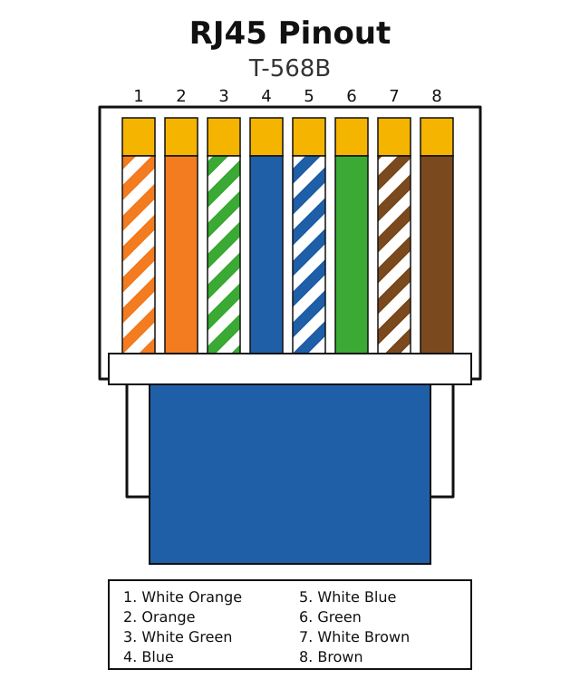

# A DIY Programming Cable for the Motorola GM950

The GM950 is cheap at hamfests and indestructible, but it always arrives programmed for whatever commercial fleet it came out of — almost certainly not the channels you want. And with no VFO, there's no way to key in a frequency from the front panel: reprogramming is the only option. The original Motorola RIB costs more than the radio.

It speaks a simple single-wire serial protocol, so you can build a working cable from a USB-to-TTL module, a 1N4148 and a 1K resistor.

## The schematic

| From | To | Notes |
| --- | --- | --- |
| RJ45 pin 2 (DATA) | TTL `RXD` | Direct |
| RJ45 pin 2 (DATA) | TTL `TXD` | Through D1 (1N4148), **anode on the radio side** |
| RJ45 pin 5 | TTL `GND` | Common ground |
| RJ45 pin 6 | RJ45 pin 8 | Through R1 (1K) — puts the radio in programming mode |

Pins 1, 3, 4 and 7 stay unconnected, as do `3V3`, `5V` and `DTR` on the module. The radio powers itself.

## Why the diode

Pin 2 is a **single bidirectional data line** — the radio transmits and receives on the same wire. The TTL module's `TXD` is push-pull, driving both high and low. Wire it straight through and the moment the radio answers you have two output stages fighting.

D1 makes `TXD` behave like an open-collector output. Anode on the radio side, cathode on `TXD`:

- `TXD` **low** → diode conducts, pulls the line low (~0.7 V, still a valid logic low).
- `TXD` **high** → diode reverse-biased, effectively gone. The radio drives the line freely.

`RXD` taps the same wire, so the adapter hears its own transmissions echo back. Normal for a single-wire bus.

Get the diode backwards and nothing works — first thing to check if the cable comes out dead.

## Finding the pins

The easiest source of an RJ45 connector is a patch cable with one end cut off. Almost all of them are wired **T568B**:

Which gives us the four wires we care about:

| Pin | T568B colour | Function |
| --- | --- | --- |
| 2 | Orange | DATA |
| 5 | White/Blue | GND |
| 6 | Green | Bridge via 1K |
| 8 | Brown | Bridge via 1K |

Two things to watch. The view above is from the **contact side with the latch facing away** — flip the plug over and the numbering reverses. And T568**A** swaps the orange and green pairs, so pins 2 and 6 land on different colours. Buzz it out with a meter before you commit; it takes a minute.

## Building it

1. Use an **RJ45 female** jack, or the cut patch cable from above.
2. Solder the 1K between pins 6 and 8 right at the connector. Use a real resistor, not a wire link.
3. Run pin 2, pin 2 (via the diode) and pin 5 out to the module. Put the diode near the module end — on a 1N4148 the black band is the cathode, and it goes to `TXD`.
4. Heatshrink everything.

Pin order on USB-TTL modules isn't standardised and clone silkscreens sometimes lie. **Wire by label, not position.**

## Before you plug it in

- Continuity from pin 5 to `GND`; ~1K between pins 6 and 8.
- Diode check pin 2 → `TXD`: forward drop one way, open the other.
- **Nothing** on `5V` or `3V3`. Check twice — 5 V into an accessory pin turns a cheap radio into a paperweight.

## Drivers

I used a **Prolific PL2303** module, and it didn't come up on Windows 11 — the in-box driver refuses to load for older and counterfeit PL2303 chips, so the port shows up flagged in Device Manager and never enumerates. The fix is the legacy driver collection at [theAmberLion/Prolific](https://github.com/theAmberLion/Prolific): v3.8.38.2 for newer (usually black) cables, v3.3.2.105 for older (usually grey) ones. Extract it, then point Device Manager's *Update driver → Have disk...* at the folder.

If you'd rather skip the hassle, a CP2102 or FTDI module works just as well here and both are still supported out of the box.

Then point your programming software at the module's COM port and **read the codeplug before changing anything**. That original file is your only way back.

## Credit

The circuit isn't mine — thanks to **Rui Barreiros, CT7BPM**, for the design.
