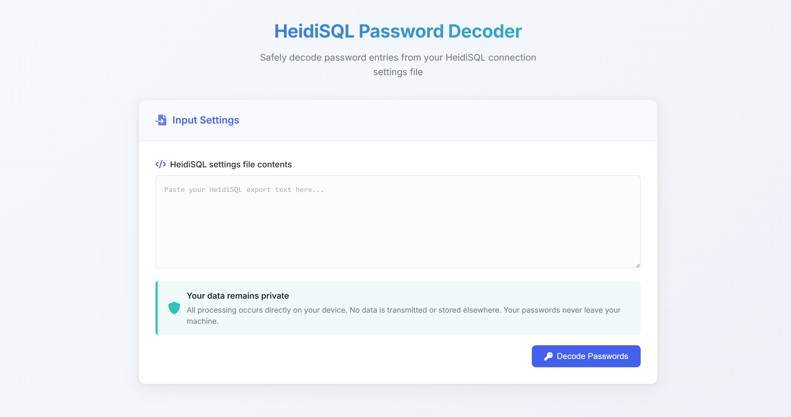

# 🔐 HeidiSQL Password Decoder

I'm excited to share a new tool I've built that solves a common problem for database administrators who use HeidiSQL. Have you ever found yourself in a situation where you need to recover a database password from your HeidiSQL connection settings? Maybe you're migrating to a new system or just need to share credentials with a colleague. That's exactly why I created the HeidiSQL Password Decoder.



**Live Demo:** [jcalado.com/heidisql_password_decoder](https://jcalado.com/heidisql_password_decoder/)

## The Problem

HeidiSQL is a fantastic database management tool, but it stores your passwords in an encoded format in its settings file. While this isn't true encryption (and isn't meant to be), it does prevent casual viewing of your passwords. When you need those passwords outside of HeidiSQL, you're typically out of luck.

## The Solution

This browser-based tool uses the same algorithm that HeidiSQL employs to encode/decode passwords but runs entirely in your browser. No data ever leaves your computer, making it a secure way to retrieve those passwords when you need them.

## ✨ Key Features

- **🔒 100% Client-side Processing**: All decoding happens in your browser - no data is ever sent to a server
- **🖥️ Clean Modern Interface**: Intuitive design with visual feedback
- **📋 Easy Copy Functionality**: One-click copy for decoded passwords
- **🔍 Smart Detection**: Automatically finds password entries in your settings file
- **🌐 Works Offline**: No internet connection required after initial page load

## 📋 How to Use It

The tool is designed to be as simple as possible:

1. Export your HeidiSQL connection settings or copy from your sessions file
2. Paste the contents into the text area
3. Click "Decode Passwords"
4. View all your server connections and their decoded passwords
5. Copy any password with a single click

## 🔍 Behind the Scenes

HeidiSQL's password encoding is relatively straightforward. The encoded password format ends with a digit that indicates the shift value used in the encoding. Here's the JavaScript function that powers the decoding:

```javascript
function heidiDecode(hex) {
    var str = '';
    var shift = parseInt(hex.substr(-1));
    hex = hex.substr(0, hex.length - 1);
    for (var i = 0; i < hex.length; i += 2)
        str += String.fromCharCode(parseInt(hex.substr(i, 2), 16) - shift);
    return str;
}
```

The algorithm works like this:
1. It takes the last character of the encoded string as a "shift" value
2. It processes the rest of the string in pairs of characters, treating them as hexadecimal values
3. It converts each hex pair to a character code, subtracts the shift value, and converts to the corresponding character
4. The resulting string is the original password

## 🔒 Privacy Considerations

When dealing with passwords, security is paramount. This tool was built with privacy as the top priority:

- No data is ever sent to any server
- All processing happens directly in your browser
- No cookies or local storage used
- No analytics or tracking
- No external requests after page load

## Why Build This?

As a developer who works with databases frequently, I've encountered situations where I needed to recover a HeidiSQL password. Rather than writing a quick script each time, I decided to build a proper tool that others might find useful as well.

The project also gave me a chance to practice creating a focused, security-conscious web application that respects user privacy while solving a specific problem.

## What's Next?

While the tool is fully functional as is, I'm considering adding support for additional database tools that use similar encoding methods. If you have suggestions or feature requests, feel free to reach out or contribute to the project.

## Source Code

View the project on [GitHub](https://github.com/jcalado/heidisql_password_decoder)
