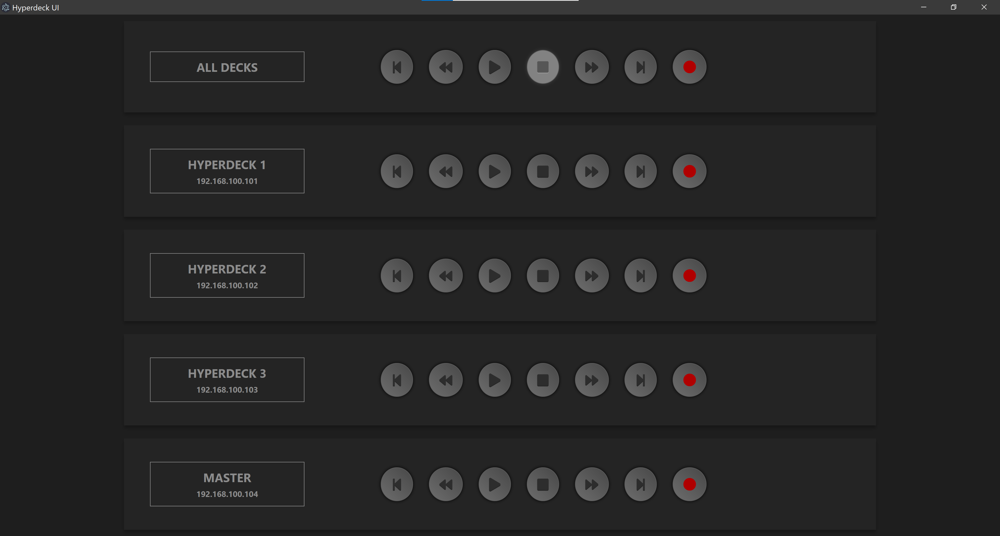

# Hyperdeckctl

Hyperdeckctl allows you to trigger common functions of your Blackmagic Design Hyperdeck recorders from a single interface.

## Preview

## Source Code

View the project on [GitHub](https://github.com/jcalado/hyperdeckctl)
