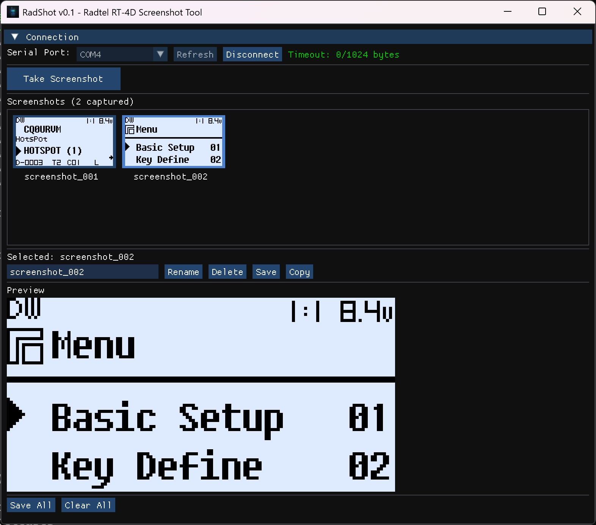

# RadShot: A Lightweight Screenshot Tool for Radtel RT-4D

If you own a Radtel RT-4D, you've probably wanted to capture what's on that little 128x64 display at some point — maybe to document a configuration, share a
channel setup, or just show off your radio's screen online.

**RadShot** is a small Windows utility that does exactly that. Connect your RT-4D via USB, click capture, and save the screenshot as a PNG.

## What It Does

- **Captures the RT-4D display** over serial connection
- **Live preview** of the captured screen
- **Gallery view** to browse multiple captures
- **Rename and organize** your screenshots
- **Export to PNG** with one click

## Why I Built It

I wanted a simple, fast tool to grab screenshots from my RT-4D without the overhead of larger applications. The result is a single executable under 300KB
that just works.

## Features

The interface is straightforward:

1. Select your COM port from the dropdown
2. Click "Capture" to grab the current display
3. Preview appears instantly
4. Save to your preferred folder

You can capture multiple screenshots in a session and browse them in the gallery view before deciding which ones to keep.

## Download

RadShot is free and open source. Grab it from GitHub:

**[github.com/jcalado/radshot](https://github.com/jcalado/radshot)**

Prebuilt Windows binaries are available in the Releases section.

## Technical Notes

For the curious: RadShot is written in C++ using Dear ImGui for the interface. The entire application compiles to a single portable executable with no
external dependencies. It communicates with the RT-4D using the same serial protocol the radio uses for programming.

---

If you're an RT-4D owner, give it a try and let me know what you think. Issues and contributions are welcome on GitHub.

---