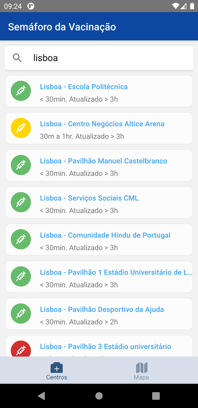

# Semáforo de Vacinação COVID - Mobile App

This React Native app consumes the same data as [covid19.min-saude.pt/cvc](https://covid19.min-saude.pt/cvc) and presents it in a friendly manner.

It is my first React Native app, so some things might not be 100% up to standard.

## Features

- Downloads real-time data from the API endpoint
- Searches by location or center name
- Shows a map with API-provided markers so you can have a sense of scale. There are a lot of centers!
- Displays how old the API-provided data is, so the user is not misled
- Provides undocumented stats such as "Pessoas em recobro", "Pessoas em espera"
- Pull down to refresh data

## Screenshots

## Source Code

View the project on [GitHub](https://github.com/jcalado/semaforodevacinacao)
