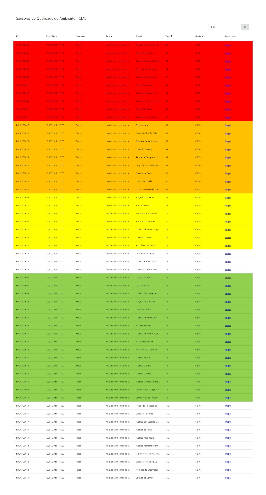

# Environmental Quality Sensors - Câmara Municipal de Lisboa

A React application that displays environmental quality sensor data from Lisbon's public API in an interactive data table.

**Live Demo:** [jcalado.com/sensores-qa-cml](https://jcalado.com/sensores-qa-cml)

## Screenshot

## Features

- Search by Sensor name
- Search by Category name
- Search by Station
- Some sensors have colored thresholds in place: low, medium, high, danger, extreme
- Every column is sortable

## Technical Notes

Requests are proxied through [allorigins.win](http://allorigins.win/), since the [original API URL](http://opendata-cml.qart.pt:8080/lastmeasurements) has CORS issues.

## Metadata Info

There's some information about the API published here: [Metadata](http://dados.cm-lisboa.pt/dataset/e7f31452-7d21-4b26-9eb5-1db62737a12d/resource/d8837f32-1f7e-4a61-bb8a-a2333f822edb/download/metadadosdadosabertos.pdf)
