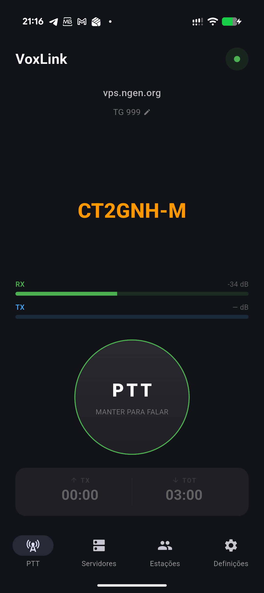
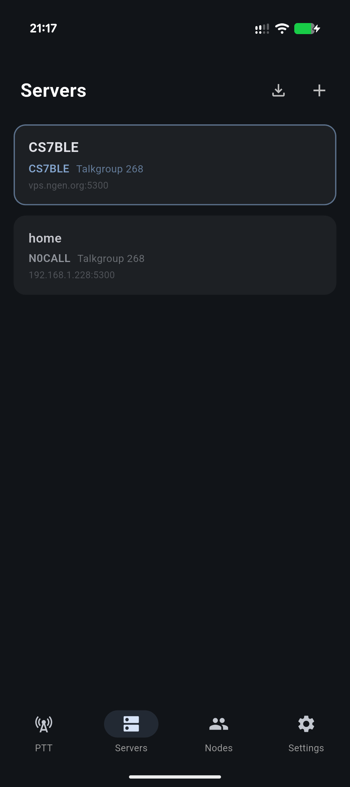
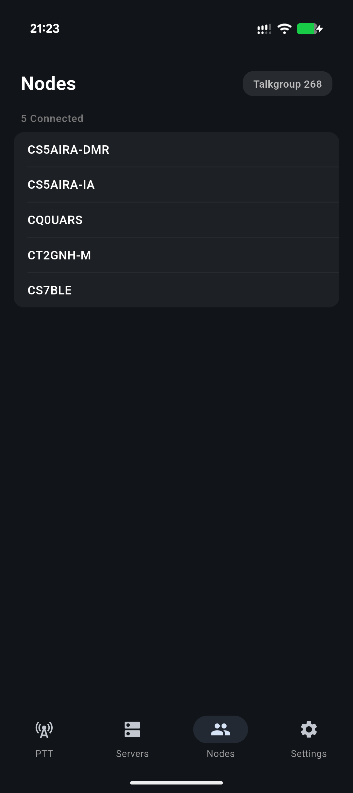

# VoxLink: A Push-to-Talk Client for SvxLink Reflectors

If you use SvxLink reflectors to connect repeaters and stations, you've probably wished you could jump on from your phone — without lugging a radio or sitting at a desktop client. **VoxLink** is an Android app that does exactly that.

Connect to any SvxLink reflector, pick a talkgroup, and hit PTT. That's it. No accounts, no subscriptions, no setup wizards.

## Why I Built It

SvxLink is a fantastic system for linking amateur radio repeaters over IP, but the options for mobile clients have always been limited. I wanted something that felt native on Android, worked reliably in the background, and didn't compromise on audio quality. So I built one.

## What It Does

VoxLink speaks the SvxLink Reflector Protocol V2 natively — TCP for control and signaling, UDP for audio. It handles authentication, heartbeats, talkgroup selection, and node tracking, all while streaming Opus-encoded audio at 16 kHz.

### Three PTT Modes

- **Hold** — press and hold to transmit, classic radio style
- **Latch** — tap to toggle TX on and off
- **VOX** — voice-activated transmission with adjustable threshold and delay

### Multiple Server Profiles

Save and switch between different reflector servers. Each profile stores its own callsign, auth key, talkgroup, and connection details. You can also import and export server configurations as JSON to share setups with other operators.

### Live Node List

See who's connected to the reflector in real time. The nodes screen shows all stations on your current talkgroup with their callsigns.

### Audio That Stays On

VoxLink runs as a foreground service with wake lock and WiFi lock, so it stays connected even with the screen off. Audio routing supports speaker, earpiece, and Bluetooth. There's also a time-out timer (configurable from 30 seconds to 10 minutes) with a vibration warning before it cuts your transmission.

### Recording

Optionally record TX and RX audio as WAV files, organized by talkgroup and timestamp. Play them back or share them directly from the app.

## Under the Hood

VoxLink is built with Flutter and uses native platform channels for low-latency audio I/O on Android. The Opus codec runs via FFI bindings to the native C library, and a custom FIR polyphase resampler handles the 48 kHz to 16 kHz conversion using SvxLink-compatible filter coefficients. An adaptive jitter buffer with packet loss concealment keeps audio smooth even on spotty connections.

State management uses Riverpod, and the UI follows Material 3 with dynamic color support.

## Get It

VoxLink is free — no ads, no in-app purchases, no subscriptions.

Available on the [Google Play Store](https://play.google.com/store/apps/details?id=com.jcalado.voxlink). More details at [voxlink.jcalado.com](https://voxlink.jcalado.com/).

---

If you're a ham using SvxLink reflectors, give VoxLink a try. Feedback and bug reports are welcome.
